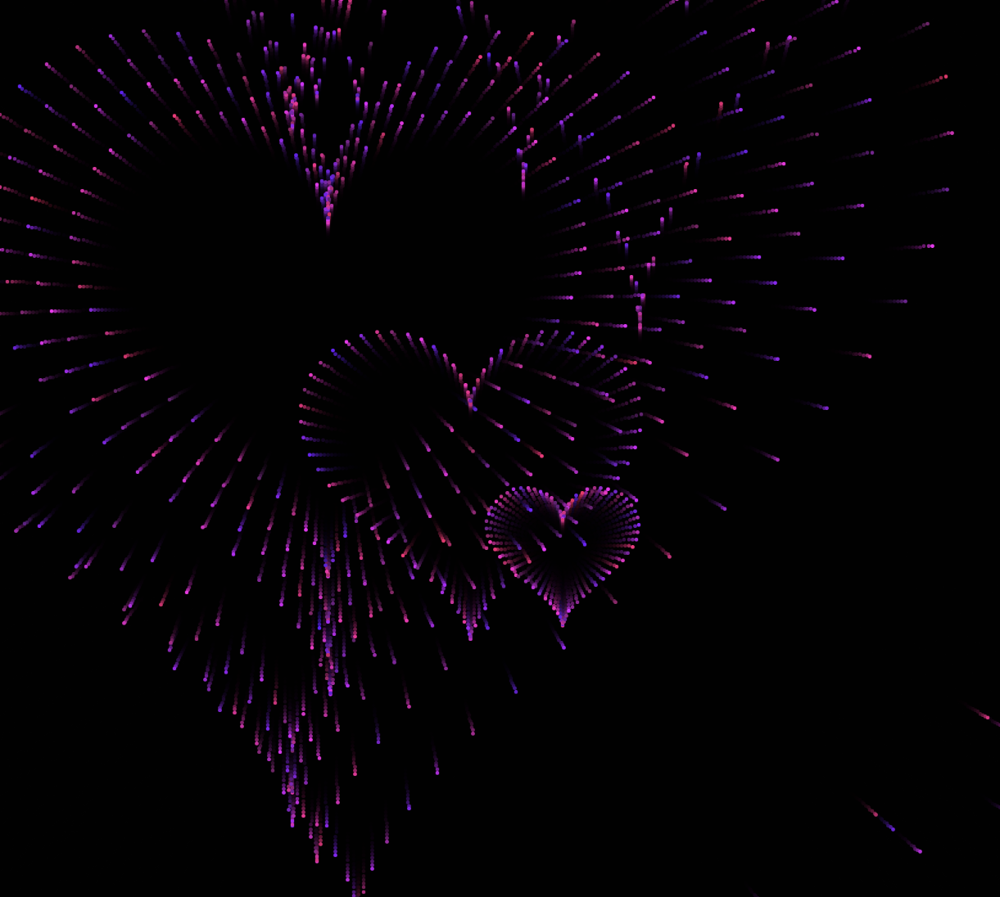

# yuli0518_9103_tut4
My first repository for IDEA9103

This is my first local change to the repo!

## Choose the technique
In the film **Doctor Strange**, Dr Strange would use magic to create a **circle** and was free to travel through space. And this magic circle would be accompanied by many **sparks**. I want to try to create such magic circle with sparks effect by using the code

[link of magic circle](https://www.youtube.com/watch?v=6BC_fbZoOdA)


### Blossom Particle

[link of making blossom particle in p5.js](https://editor.p5js.org/AnonymousPyro/sketches/Q2XUJXm5)


This is the code for an effect where particles bloom in the shape of a heart on mouse click. I think I can achieve the effect I want by turning the heart into a circle, and then changing the way the particles move, from clicking to automatic continuous emission.

**-Main code**

- Use "drawApllonian" in `function setup()` 
  
  ```
  function setup() {
  drawApollonian();}
  ```
- Use `function drawApollonian()`
  ```
  function drawApollonian() {}
  ```
- Also, we should define `randomPosition`, `randomAngle`, `randomRadius` to make the circles show in random places.
