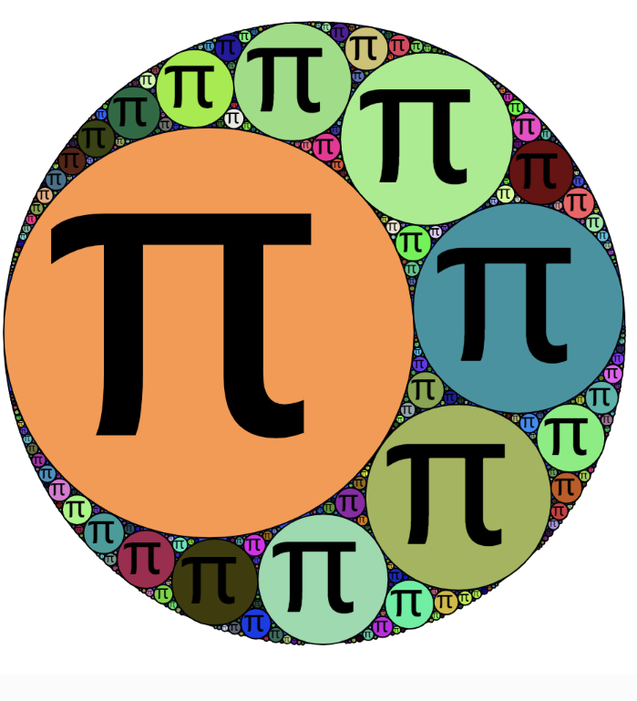
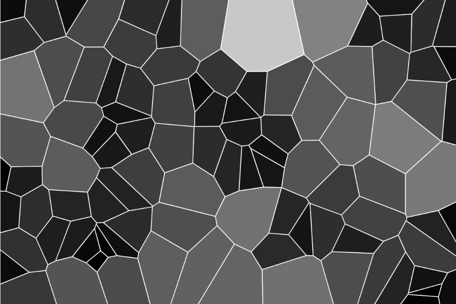

# yuli0518_9103_tut4
My first repository for IDEA9103

This is my first local change to the repo!

## Choose the technique
In the film **Doctor Strange**, Dr Strange would use magic to create a **circle** and was free to travel through space. And this magic circle would be accompanied by many **sparks**. I want to try to create such magic circle with sparks effect by using the code

[link of magic circle](https://www.youtube.com/watch?v=6BC_fbZoOdA)


### 1.Apollonian Gasket

[link of making Apllonian gasket in p5.js](https://editor.p5js.org/jcponce/sketches/9yollBM7C)


This code technique can solve the speckled part of the main mushroom in the picture.

**-Main code**

- Use "drawApllonian" in `function setup()` 
  
  ```
  function setup() {
  drawApollonian();}
  ```
- Use `function drawApollonian()`
  ```
  function drawApollonian() {}
  ```
- Also, we should define `randomPosition`, `randomAngle`, `randomRadius` to make the circles show in random places.


### 2.Voronoi
[link of making Voronoi](https://editor.p5js.org/MR-Addict/sketches/VthoYyYFm)


Voronoi split code technology can solve the background of this artwork, and with some upgrades and random generation can be close to the original.

**-Main code**

- Save random points in the seeds array in `function setup()`.
  ```
  function setup() {
  for (let i = 0; i < 100; i++) {
    seeds.push([random(width), random(height)]);
  }}

  ```
- Use `delaunay` and `voronoi` in `function draw()` to paint the Voronoi shape.
  ```
  function draw() {

  const delaunay = d3.Delaunay.from(seeds);

  const voronoi = delaunay.voronoi([0, 0, width, height]);
  }

  ```
- We can also use `renderPolygons` to have different fills, but considering that the background of the original image is only one colour, so we don not need to do that.